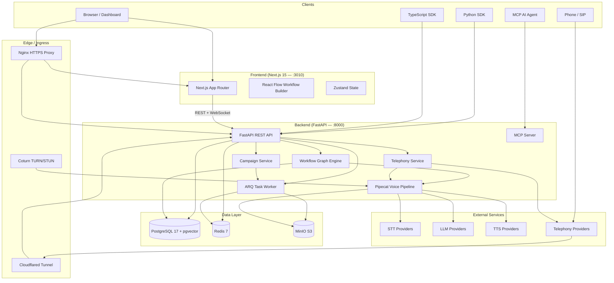
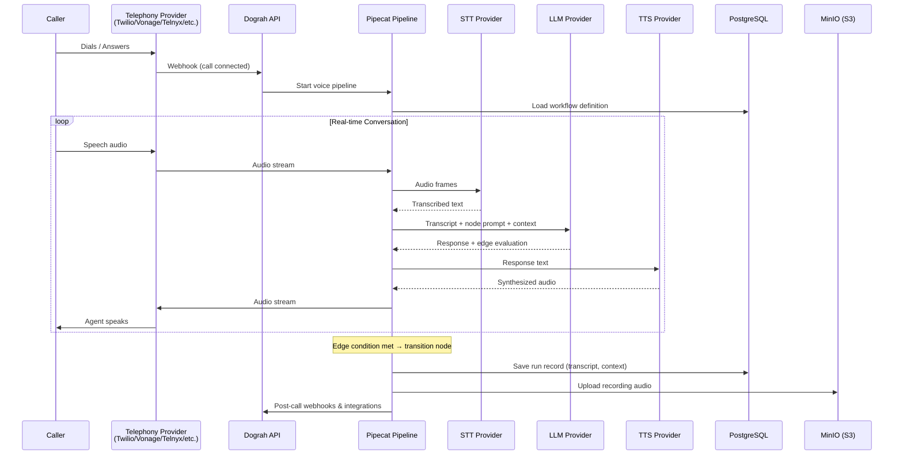
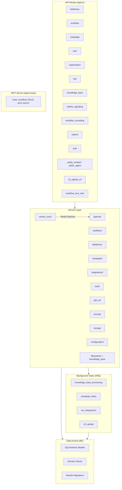
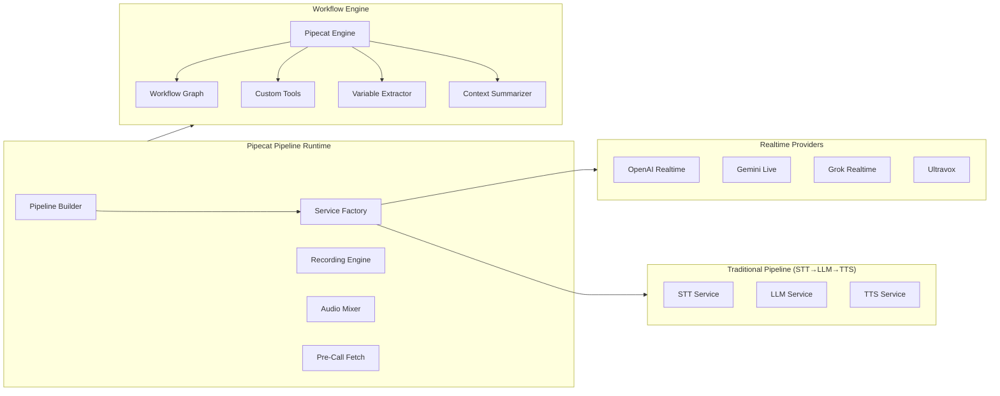
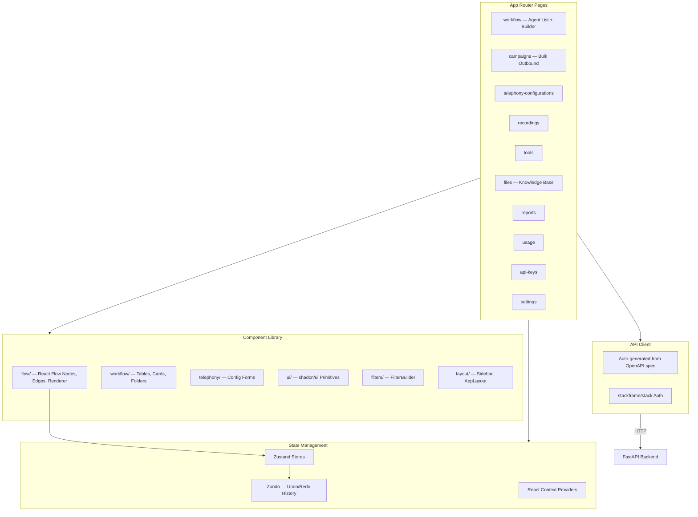
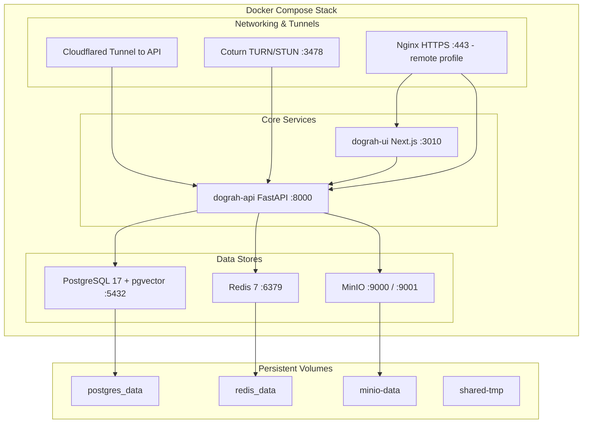
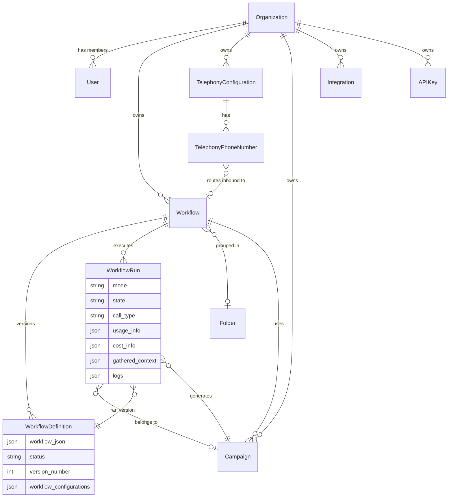
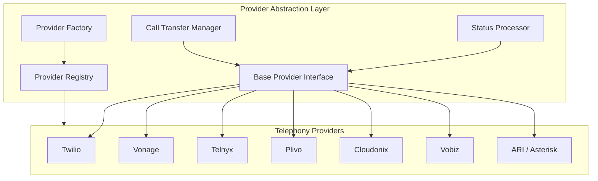

# Dograh AI — Architecture Overview

## System Context

Dograh is an open-source, self-hostable voice AI platform for building conversational agents with telephony and WebRTC support. Users define conversation flows as directed graphs (workflows), connect phone numbers, and Dograh orchestrates real-time STT → LLM → TTS pipelines.

---

## High-Level Architecture

---

## Voice Call Flow (Core Loop)

---

## Backend Architecture

---

## Pipecat Voice Pipeline Detail

---

## Frontend Architecture

---

## Infrastructure & Deployment

---

## Data Model (Core Entities)

---

## Telephony Provider Architecture

---

## Key Design Decisions

| Aspect | Choice | Rationale |
|--------|--------|-----------|
| Voice pipeline | Pipecat (git submodule) | Open-source framework for real-time voice AI, supports multiple providers |
| Realtime vs Traditional | Both paths | Realtime (OpenAI/Gemini/Grok) for lowest latency; traditional STT→LLM→TTS for flexibility |
| Task queue | ARQ (Redis-based) | Lightweight, async-native, shares Redis with cache/pub-sub |
| Workflow versioning | Immutable definitions | Every publish creates a new WorkflowDefinition; runs reference the exact version used |
| Multi-tenancy | Organization-scoped | All resources filtered by organization_id; strict tenant isolation |
| Telephony abstraction | Provider pattern | Common interface with per-provider implementations; new providers added without core changes |
| Frontend state | Zustand + Zundo | Lightweight stores with built-in undo/redo for the workflow builder |
| API client | Auto-generated | `openapi-ts` generates typed client from backend OpenAPI spec |
| Public access | Cloudflared tunnel | Zero-config public URL for telephony webhooks without port forwarding |
| WebRTC NAT traversal | Coturn | Self-hosted TURN server for reliable browser-to-server audio |
| Worker sync | Redis pub/sub | Propagates config changes across multiple FastAPI worker processes |
